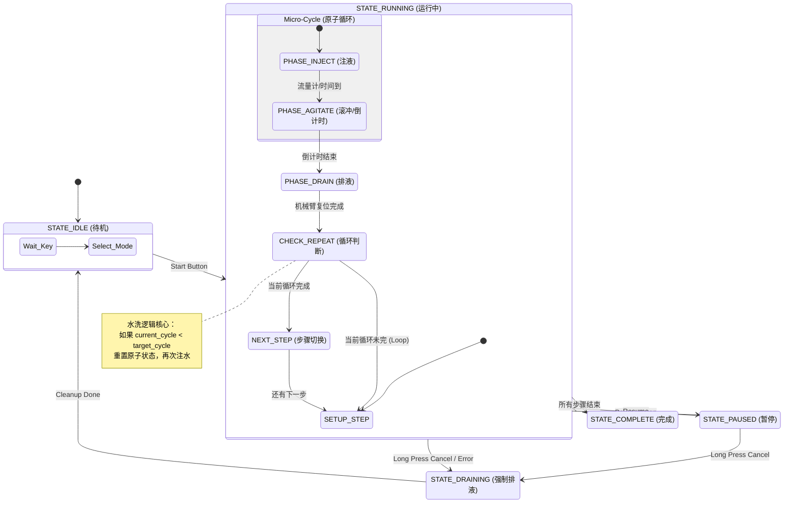

# 自动滚冲机

```mermaid
  stateDiagram-v2
    [*] --> STATE_IDLE

    state "STATE_IDLE (待机)" as STATE_IDLE {
        direction LR
        Wait_Key --> Select_Mode
    }

    state "STATE_RUNNING (运行中)" as STATE_RUNNING {
        direction TB
        
        %% 初始化当前步骤
        [*] --> SETUP_STEP
        
        state "Micro-Cycle (原子循环)" as MicroCycle {
            state "PHASE_INJECT (注液)" as P_INJ
            state "PHASE_AGITATE (滚冲/倒计时)" as P_AGI
            state "PHASE_DRAIN (排液)" as P_DRAIN
            
            [*] --> P_INJ
            P_INJ --> P_AGI: 流量计/时间到
            P_AGI --> P_DRAIN: 倒计时结束
        }

        %% 循环判断逻辑
        P_DRAIN --> CHECK_REPEAT: 机械臂复位完成
        
        state "CHECK_REPEAT (循环判断)" as CHECK_REPEAT
        note right of CHECK_REPEAT
            水洗逻辑核心：
            如果 current_cycle < target_cycle
            重置原子状态，再次注水
        end note

        CHECK_REPEAT --> SETUP_STEP: 当前循环未完 (Loop)
        CHECK_REPEAT --> NEXT_STEP: 当前循环完成
        
        state "NEXT_STEP (步骤切换)" as NEXT_STEP
        NEXT_STEP --> SETUP_STEP: 还有下一步
    }

    state "STATE_PAUSED (暂停)" as STATE_PAUSED
    state "STATE_DRAINING (强制排液)" as STATE_DRAINING
    state "STATE_COMPLETE (完成)" as STATE_COMPLETE

    %% 状态跳转
    STATE_IDLE --> STATE_RUNNING: Start Button
    STATE_RUNNING --> STATE_PAUSED: Pause Button
    STATE_PAUSED --> STATE_RUNNING: Resume
    STATE_RUNNING --> STATE_COMPLETE: 所有步骤结束
    
    %% 异常与取消
    STATE_RUNNING --> STATE_DRAINING: Long Press Cancel / Error
    STATE_PAUSED --> STATE_DRAINING: Long Press Cancel
    STATE_DRAINING --> STATE_IDLE: Cleanup Done
```